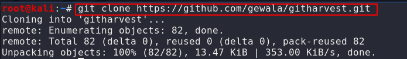

# Red Teaming Squad

## GitHarvester

GitHub is a large cloud-based software repository that uses the git protocol. Creating a GitHub account is painless and free for anyone who is interested. You don’t even need to supply a valid email address to get an account.

Once you sign up for a GitHub account, you are free to publish any code you want to it and anyone in the world can view your code, download it, or fork it and build their own version of it.

Much like Google Dorks, GitHub has a certain amount of keywords that can be used in order to refine its search results. Some of these keywords are “filename,” “extension,” and “path.”

On GitHub, you are able to find wordpress configuration files, SFTP server configuration files, RSA private keys, SQL dumps, and much more.

So to harvest that data one tool is useful which name is `GitHarvester` 

Basically This tool is used for harvesting information from GitHub. By default it looks
for code with the filename of 'wp-config.php' and pulls out auth info.

### Installation

You can download this tool from [github](https://github.com/gewala/githarvest). using following commands.

`git clone https://github.com/gewala/githarvest.git` 

<kbd></kbd>

```
cd pwndb
ls
```
This tool is build on python so you have to run githarvester.py file for using the tool.

<kbd></kbd>

Run following command.

`python3 githarvester.py.py -h`

It will give the options that we can use.

