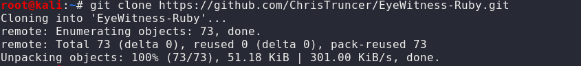
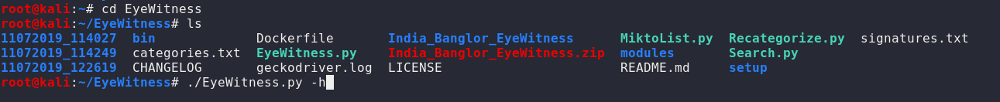
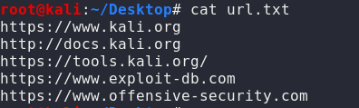
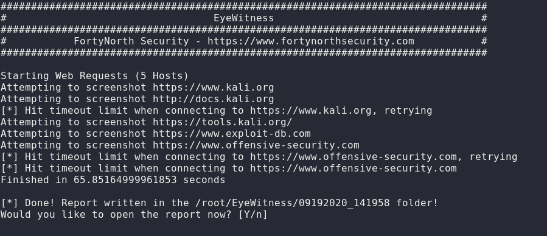

# Red Teaming Squad

## EyeWitness

EyeWitness is designed to take screenshots of websites, RDP services, and open VNC servers, provide some server header info, and identify default credentials if possible.

EyeWitness is designed to run on Kali Linux. It will auto detect the file you give it with the -f flag as either being a text file with URLs on each new line, nmap xml output, or nessus xml output. The --timeout flag is completely optional, and lets you provide the max time to wait when trying to render and screenshot a web page.

### Installation

You can download this tool from [github](https://github.com/ChrisTruncer/EyeWitness-Ruby) or using following commands.

```
git clone https://github.com/ChrisTruncer/EyeWitness-Ruby.git
cd EyeWitness
```
<kbd></kbd>

<kbd></kbd>

### Usage

You can check its usage using ```./EyeWitness.py -h```


```

################################################################################
#                                  EyeWitness                                  #
################################################################################

usage: EyeWitness.py [--web] [--headless] [--rdp] [--vnc] [--all-protocols]
                     [-f Filename] [-x Filename.xml] [--single Single URL]
                     [--createtargets targetfilename.txt] [--no-dns]
                     [--timeout Timeout] [--jitter # of Seconds]
                     [--threads # of Threads] [-d Directory Name]
                     [--results Hosts Per Page] [--no-prompt]
                     [--user-agent User Agent] [--cycle User Agent Type]
                     [--difference Difference Threshold]
                     [--proxy-ip 127.0.0.1] [--proxy-port 8080]
                     [--show-selenium] [--resolve]
                     [--add-http-ports ADD_HTTP_PORTS]
                     [--add-https-ports ADD_HTTPS_PORTS] [--prepend-https]
                     [--vhost-name hostname] [--active-scan] [--resume ew.db]

EyeWitness is a tool used to capture screenshots from a list of URLs

Protocols:
  --web                 HTTP Screenshot using Selenium
  --headless            HTTP Screenshot using PhantomJS Headless
  --rdp                 Screenshot RDP Services
  --vnc                 Screenshot Authless VNC services
  --all-protocols       Screenshot all supported protocols, using Selenium for
                        HTTP

Input Options:
  -f Filename           Line seperated file containing URLs to capture
  -x Filename.xml       Nmap XML or .Nessus file
  --single Single URL   Single URL/Host to capture
  --createtargets targetfilename.txt
                        Parses a .nessus or Nmap XML file into a line-
                        seperated list of URLs
  --no-dns              Skip DNS resolution when connecting to websites

Timing Options:
  --timeout Timeout     Maximum number of seconds to wait while requesting a
                        web page (Default: 7)
  --jitter # of Seconds
                        Randomize URLs and add a random delay between requests
  --threads # of Threads
                        Number of threads to use while using file based input

Report Output Options:
  -d Directory Name     Directory name for report output
  --results Hosts Per Page
                        Number of Hosts per page of the report
  --no-prompt           Don't prompt to open the report

Web Options:
  --user-agent User Agent
                        User Agent to use for all requests
  --cycle User Agent Type
                        User Agent Type (Browser, Mobile, Crawler, Scanner,
                        Misc, All
  --difference Difference Threshold
                        Difference threshold when determining if user agent
                        requests are close "enough" (Default: 50)
  --proxy-ip 127.0.0.1  IP of web proxy to go through
  --proxy-port 8080     Port of web proxy to go through
  --show-selenium       Show display for selenium
  --resolve             Resolve IP/Hostname for targets
  --add-http-ports ADD_HTTP_PORTS
                        Comma-seperated additional port(s) to assume are http
                        (e.g. '8018,8028')
  --add-https-ports ADD_HTTPS_PORTS
                        Comma-seperated additional port(s) to assume are https
                        (e.g. '8018,8028')
  --prepend-https       Prepend http:\\ and https:\\ to URLs without either
  --vhost-name hostname
                        Hostname to use in Host header (headless + single mode
                        only)
  --active-scan         Perform live login attempts to identify credentials or
                        login pages.

Resume Options:
  --resume ew.db        Path to db file if you want to resume
```

## eyewitness Usage Example:

* First we have to create one URL list.

 <kbd></kbd>

* By using following command  ```eyewitness -f /root/Desktop/url.txt``` 

 It will take a screenshot of each of the websites listed in the provided file.

<kbd></kbd>

* It will create one screens folder into the eyewitness directory.
 
<kbd></kbd>
