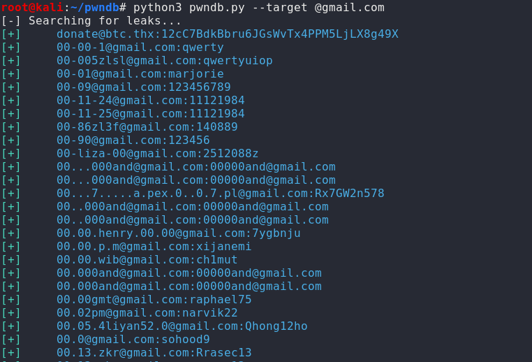

# Red Teaming Squad

## Pwndb

A data leak differs from a data breach in that the former usually happens through omission or faulty practices rather than overt action, and may be so slight that it is never detected. While a data breach usually means that sensitive data has been harvested by someone who should not have accessed it, a data leak is a situation where such sensitive information might have been inadvertently exposed. pwndb is an onion service where leaked accounts are searchable using a simple form.

After a breach occurs the data obtained is often put on sale. Sometimes, people try to blackmail the affected company, asking for money in exchange of not posting the data online. The second option is selling the data to a competitor, a rival or even an enemy. This data is used in so many different ways by companies and countries… but when the people responsible for obtaining the data fail on selling it, the bundle becomes worthless and they end up being placed in some sites like pastebin or pwndb.

It is a python command-line tool for searching leaked credentials using the Onion service with the same name.

### Installation

You can download this tool from [github](https://github.com/davidtavarez/pwndb) or using following commands.

`git clone https://github.com/davidtavarez/pwndb`

<kbd></kbd>

```
cd pwndb
ls
```

pwndb.py is a python command-line tool for searching leaked credentials using the Onion service with the same name
<kbd></kbd>

After that Just create a virtualenv by using following commands.

```
virtualenv venv
source venv/bin/activate
```
<kbd></kbd>

Run following command.

`python3 pwndb.py -h`

It will give the options that we can use.

<kbd></kbd>

Note: tor service must be up and running to be connected to port 9050.

For that use following command to run tor.

`tor`

<kbd></kbd>

After running the tor use following command to search leaks.

`python3 pwndb.py --target @gmail.com`

<kbd></kbd>